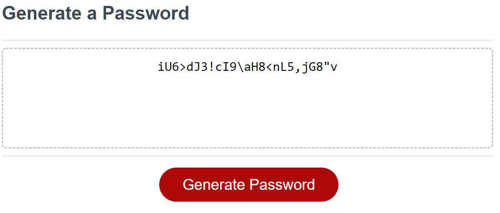

# Password Generator

Link: https://meemofu.github.io/Password-generator/

## Preview

## Method

1. Take user input, including the length and the type of characters, error check included

2. A loop will alternate between 4 character types: lowercase, uppercase, number, and special characters

3. The password will only appended the types that the user specified, the type of character is then generated randomly with Math.random()

4. The generated password is returned
